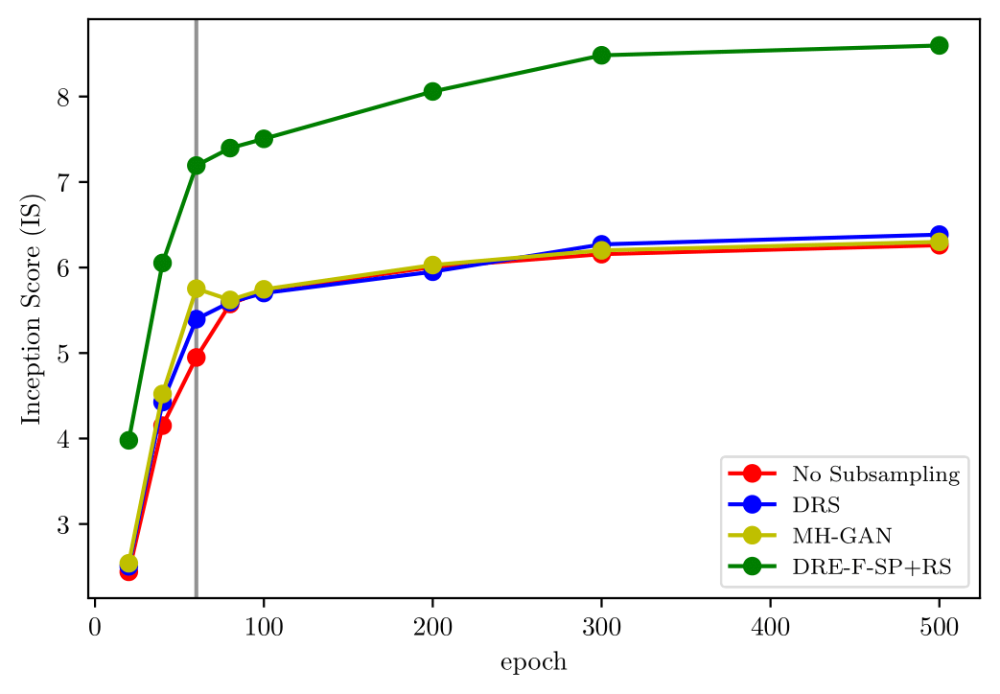

# Codes for the experiments in "[Subsampling Generative Adversarial Networks: Density Ratio Estimation in Feature Space with Softplus Loss](https://arxiv.org/abs/1909.10670)"
# 1. To do list
- [x] The 25 2-D Gaussians Simulation
- [x] The Reduced MNIST dataset
- [x] The CIFAR-10 dataset
- [x] The CelebA dataset
- [x] The STL-10 dataset


# 2. Sample Usage
## 2.1 Simulation
```
# DRE-SP+RS with lambda=0
python3 main.py --NSIM 3 --DRE DRE_SP --Sampling RS --epoch_DRE 5 --base_lr_DRE 1e-3 --lambda_DRE 0 --DR_final_ActFn ReLU --batch_size_DRE 512 --epoch_gan 5
```

## 2.2 CIFAR-10
```
# pre-train a ResNet34 for feature extraction
python3 PreTrainCNN.py --CNN ResNet34 --isometric_map --transform

# pre-train an InceptionV3 for evaluation
python3 PreTrainCNN.py --CNN InceptionV3 --transform

# DCGAN, DRE-F-SP+RS with lambda=0.01
python3 main.py --GAN DCGAN --DRE DRE_F_SP --Sampling RS --lambda_DRE 0.01 --samp_nfake 50000 --DR_final_ActFn ReLU --epoch_DRE 200 --base_lr_DRE 1e-4
```

## 2.3 Reduced MNIST

First, run 'data_processing.py' to reduce the size the training set to 5000 and store data in a h5 file.

Then, 

```
# Pre-train ResNet34 for feature extraction
python3 PreTrainCNN.py --CNN ResNet34 --N_TRAIN 5000 --isometric_map --transform --batch_size_train 512 --base_lr 0.01 --epochs 200


# pre-train InceptionV3 for computing IS and FID
python3 PreTrainCNN.py --CNN InceptionV3 --transform --batch_size_train 32

# DCGAN: DRE-F-SP+RS with lambda=0.01
python3 main_unsupervised.py --N_TRAIN 5000 --GAN DCGAN --epoch_gan 500 --DRE DRE_F_SP --Sampling RS --lambda_DRE 0.01 --samp_nfake 50000 --DR_final_ActFn ReLU --epoch_DRE 500 --epoch_pretrainCNN 200 --base_lr_DRE 1e-4  --comp_ISFID --samp_round 3
```

## 2.4 CelebA
First, download (http://mmlab.ie.cuhk.edu.hk/projects/CelebA.html) and uncompress the CelebA dataset. Put the folder 'img_align_celeba' under './data'.

Second, run './data/preprocess_celeba.py' to prepare the data. A h5 file will be generated.

Third, 

```
# Pre-train a ResNet34 for feature extraction
python3 PreTrainCNN.py --CNN ResNet34 --isometric_map --epochs 100 --batch_size_train 256 --batch_size_test 128 --base_lr 1e-3 --num_classes 6 --transform

# SNGAN: DRE-F-SP+RS with lambda=0.01
python3 main.py --GAN SNGAN --epoch_gan 100 --DRE DRE_F_SP --Sampling RS --PreCNN_DR ResNet34 --epoch_pretrainCNN 100 --DR_Net MLP5 --lambda_DRE 0.01 --samp_nfake 50000 --DR_final_ActFn ReLU --epoch_DRE 100 --base_lr_DRE 1e-4 --comp_ISFID --samp_batch_size 1000 --samp_round 1
```

## 2.5 STL-10 (64x64)

```
# fine tune the fully connected layers attached to ResNet34
python3 PreTrainFC.py --CNN ResNet34 --epochs 50 --batch_size_train 64 --batch_size_test 64 --base_lr 0.01 --transform --resume_epoch 0

# SNGAN: DRE-F-SP+RS with lambda=0.01
python3 main.py --GAN SNGAN --epoch_gan 500 --DRE DRE_F_SP --Sampling RS --PreCNN_DR ResNet34 --epoch_fc 50 --DR_Net MLP5 --lambda_DRE 0.01 --samp_nfake 50000 --epoch_DRE $EPOCH_DRE --base_lr_DRE 1e-4 --KS_test --comp_ISFID --samp_batch_size 1000
```


# 3. Some Results
## 3.1 CIFAR10
### 3.1.1 IS/FID versus epoch of GAN training
 
 


# Misc Notes
If you use this code, please cite
```text
@article{ding2019subsampling,
  title={Subsampling Generative Adversarial Networks: Density Ratio Estimation in Feature Space with Softplus Loss},
  author={Ding, Xin},
  journal={arXiv preprint arXiv:1909.10670},
  year={2019}
}
```